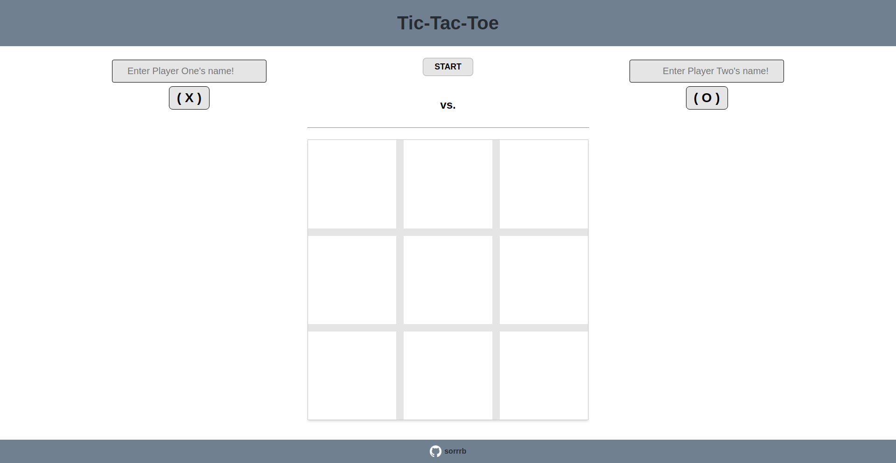

# tic-tac-toe
A webpage implementation of a basic Tic-Tac-Toe game 

[Live Demo](https://sorrrb.github.io/tic-tac-toe/)

## Demo Preview

### Changelog
9/16/2022 17:56 - complete functionality of Tic-Tac-Toe for manual play
1/03/2024 10:27 - rework app logic for proper object conceptual understanding

### Languages
- HTML
- CSS
- JavaScript (vanilla - ES6)

## Attribution(s)
[Rajnish Katharotiya](https://dev.to/rajnishkatharotiya/function-to-check-if-all-records-are-equal-in-array-javascript-3mo3#:~:text=Javascript%20Useful%20Snippets%20%E2%80%94%20allEqual(),allEqual%20%3D%20arr%20%3D%3E%20arr.)
[Joe, Yangshun Tay](https://stackoverflow.com/questions/17428587/transposing-a-2d-array-in-javascript)

#### To-Do
- Computer Play 